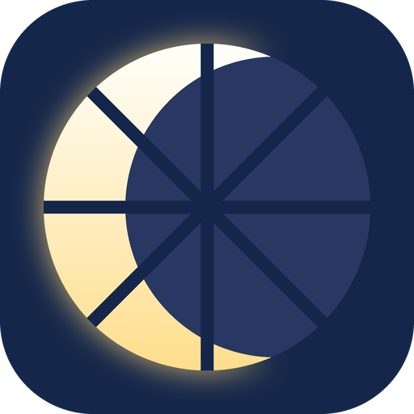

# Dalbit

**Plug in your Android tablet with a USB cable and use it as a second monitor for your PC.**

Dalbit (달빛, Korean for "moonlight") is a fork of [Artemis Android](https://github.com/ClassicOldSong/moonlight-android)
built around one use case: an Android tablet next to a Windows PC running [Sunshine](https://github.com/LizardByte/Sunshine),
connected over USB and used as an extra screen. It is still a full Moonlight client, so the same app also streams games
over Wi-Fi or the internet when you are away from the PC.

## Why USB

Over USB tethering the stream does not compete with Wi-Fi traffic or interference. On a Lenovo tablet at 3200x1800 and
120 FPS, the network part of the delay measured about 1 ms with no jitter, so what is left is encode, decode and display time.
Dalbit finds the PC on the cable by itself; you do not have to type an IP address or remember to switch networks.

## What Dalbit adds to Artemis

* **USB first**: when the tablet shares a USB tethering link with the PC, Dalbit finds the host on that link and streams over the
  cable, falling back to Wi-Fi or the internet when it is not there (Host Settings > Prefer the USB tethering link).
* **Made for an extended desktop**: per-app settings let a second-monitor app behave like a monitor while other apps behave
  like a game stream. "Touchscreen apps" always use the screen as a touchscreen, and "Host-only audio apps" keep the sound on
  the PC.
* **Scriptable**: launcher shortcuts accept a `Quit` extra to end the running host app without a dialog, so a script on the PC
  can turn the tablet monitor on and off without touching the tablet.
* **No 60 Hz cap from vendor game modes**: Dalbit is not declared as a game, so modes like Lenovo ZUI's do not lock it to 60 Hz.
* **Keyboard cover input**: touchpad tap, drag and two-finger gestures in local cursor mode (fixes taps registering as right
  clicks on Lenovo ZUI tablets), and the host Korean/English input mode follows the tablet keyboard language.

## Setting up a USB second monitor

1. On the PC, run Sunshine with a virtual display driver and an app that extends the desktop onto that display.
2. Connect the tablet with a USB cable and turn on **USB tethering** on the tablet.
3. In Dalbit, pair with the PC once (over Wi-Fi or the cable), then start the extended desktop app.
4. In Dalbit settings, add that app's name to **Touchscreen apps** and **Host-only audio apps**.

Android turns USB tethering off whenever the cable is reconnected. It can be turned back on from the PC with
`adb shell svc usb setFunctions rndis` when USB debugging is enabled.

Dalbit has been tested on one Lenovo tablet (Android 16) so far.
It stays under the same GPLv3 license as Artemis and Moonlight. Everything below is the original Artemis README.

---

# Artemis Android

Previously named Moonlight Noir

An open source client for [Apollo](https://github.com/ClassicOldSong/Apollo)/[Sunshine](https://github.com/LizardByte/Sunshine).

Artemis Android will allow you to stream your collection of games from your Windows PC to your Android device,
whether in your own home or over the internet.

Artemis is currently the best fork of Moonlight with loads of optimizations for office usage.

A more seamless experience with virtual display will be Artemis paired with [Apollo](https://github.com/ClassicOldSong/Apollo).

# Features

If you switch back to the main stream version, you'll be missing the following awesome features which are very unlikely to be added there:

1. Custom virtual buttons with import and export support.
2. [Custom resolutions](https://github.com/moonlight-stream/moonlight-android/pull/1349).
3. Custom bitrates.
4. [Multiple mouse mode switching](https://github.com/moonlight-stream/moonlight-android/pull/1304) (normal mouse, [multi-touch](https://github.com/moonlight-stream/moonlight-android/pull/1364), touchpad, disabled, local cursor mode).
5. Optimized virtual gamepad skins and free joystick.
6. External monitor mode.
7. Joycon D-pad support.
8. Simplified performance information display.
9. [Game back menu](https://github.com/moonlight-stream/moonlight-android/pull/1171).
10. Custom shortcut commands.
11. Easy soft keyboard switching.
12. Portrait mode.
13. Display on top mode, useful for foldable phones.
14. [Virtual touchpad space and sensitivity adjustment](https://github.com/moonlight-stream/moonlight-android/issues/1348#issuecomment-2236344729) for playing right-click view games, such as Warcraft.
15. Force use device's own vibration motor (in case your gamepad's vibration is not effective).
16. Gamepad debugging page to view gamepad vibration and gyroscope information, as well as Android kernel version information.
17. Trackpad tap/scrolling support
18. Natural track pad mode with touch screen
19. Non-QWERTY keyboard layout support
20. Quick Meta key with physical BACK button
21. Frame rate lock fix for some devices
22. Video scale mode: Fit/Fill/Stretch
23. View pan/zoom support
24. Rotate screen in-game
25. Add option to quit app directly
26. Samsung DeX scrolling support
27. Proper click/scroll/right-click for trackpad on generic Android tablet when using local cursor
28. Virtual Display integration with [Apollo](https://github.com/ClassicOldSong/Apollo)
29. Server Command integration with [Apollo](https://github.com/ClassicOldSong/Apollo)
30. Clipboard sync (requires Apollo)
31. SBS 3D for external Displays (Using AI MiDaS v2 Lite)

# Disclaimer

This is the `go away` version of Moonlight Android.

I got kicked from Moonlight and Sunshine's Discord server literally for helping people out.

This is what I got for finding a bug, opened an issue, getting no response, troubleshoot myself, fixed the issue myself, shared it by PR to the main repo hoping my efforts can help someone else during the maintainance gap.

Yes, I'm going away. Fixes and improvements on this fork are not necessarily be merged to the main repo either. I have also started [a fork of Sunshine called Apollo](https://github.com/ClassicOldSong/Apollo) and will add useful features that will never get merged by the main repo shortly. [Apollo](https://github.com/ClassicOldSong/Apollo) and [Moonlight Noir](https://github.com/ClassicOldSong/moonlight-android) will no longer be compatible with OG Sunshine and OG Moonlight eventually, but they'll work even better with much more carefully designed features.

The main repo had stayed silent for 5 months, with nobody actually responding to issues, and people are getting totally no help besides the limited FAQ in their Discord server. I tried to answer issues and questions, solve problems within my ablilty but I got kicked out just for helping others.

**PRs for feature improvements are welcomed here unlike the main repo, your ideas are more likely to be appreciated and your efforts are actually being respected. We welcome people who can and willing to share their efforts, helping yourselves and other people in need.**

**Update**: They have contacted me and apologized for this incident, but the fact it **happened** still motivated me to start my own fork.

## Downloads
* [Download APK directly](https://github.com/ClassicOldSong/moonlight-android/releases)
* [Use Obtainium](https://apps.obtainium.imranr.dev/redirect?r=obtainium://app/%7B%22id%22%3A%22com.limelight.noir%22%2C%22url%22%3A%22https%3A%2F%2Fgithub.com%2FClassicOldSong%2Fmoonlight-android%22%2C%22author%22%3A%22ClassicOldSong%22%2C%22name%22%3A%22Artemis%22%2C%22additionalSettings%22%3A%22%7B%5C%22apkFilterRegEx%5C%22%3A%5C%22nonRoot%5C%22%2C%5C%22matchGroutToUse%5C%22%3A%5C%22%241%5C%22%2C%5C%22versionExtractionRegEx%5C%22%3A%5C%22v(.%2B)%5C%22%7D%22%7D) (recommended)

## Building
* Install Android Studio and the Android NDK
* Run ‘git submodule update --init --recursive’ from within moonlight-android/
* In moonlight-android/, create a file called ‘local.properties’. Add an ‘ndk.dir=’ property to the local.properties file and set it equal to your NDK directory.
* Build the APK using Android Studio or gradle

## Authors

* [Cameron Gutman](https://github.com/cgutman)  
* [Diego Waxemberg](https://github.com/dwaxemberg)  
* [Aaron Neyer](https://github.com/Aaronneyer)  
* [Andrew Hennessy](https://github.com/yetanothername)

Moonlight is the work of students at [Case Western](http://case.edu) and was
started as a project at [MHacks](http://mhacks.org).
